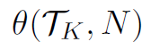

# Compute Turan Density Coefficient for k-PDG (k-uniform partially directed hypergraphs)

## Introduction
This program computes the `min_theta` value for k-PDGs with given number of vertices and are free of certain graphs. First we'll define the concepts.


## Results
Values in the table are  for the various `K,N` combinations.

| N   | K=2 | K=3   | K=4   | K=5   | K=6   | K=7   |
| --- | --- | ----- | ----- | ----- | ----- | ----- |
| 2   |   1 |       |       |       |       |       |
| 3   | 3/2 |   1   |       |       |       |       |
| 4   | 3/2 | 4/3   |     1 |       |       |       |
| 5   | 5/3 | 5/3   |   5/4 |     1 |       |       |
| 6   | 5/3 | 5/3   |   3/2 |   6/5 |     1 |       |
| 7   | 7/4 |  ?    |   7/4 |   7/5 |   7/6 |     1 |
| 8   | 7/4 |  ?    |  ?    |   ?   |   ?   |   8/7 |

All results shown in this table can be obtained very fast using optimized build, except
* `K=5, N=7` takes a few minutes on a regular computer
* `K=3, N=7` is likely computationally feasible given enough CPU hours, but there is no sufficient reason to compute it.
* `K=4, N=7` took almost 6600 CPU hours in total on Google Cloud, in 30 batches. The log files are in the `results` directory. the `collector` utility is used to verify the consistency of all log files to summarize the final result. The graph that produced `theta=7/4` value is the following (note it's symmetric over {5,6}, making it easy to verify by hand).
```
{
  0125>5, 0135>5, 0235>5, 1235>5, 0145>5, 0245>5, 1245>5, 0345>5, 1345>5, 2345>5, 
  0126>6, 0136>6, 0236>6, 1236>6, 0146>6, 0246>6, 1246>6, 0346>6, 1346>6, 2346>6
}
```


## Running the program
The easiest way to run is to get the binaries from either `bin-linux` or `bin-windows` directories. Alternatively, you can build from source, see next section for details. To run the program:

`  kPDG K N T`

where `K`, `N` are explained above, and `T` is the number of threads in the final enumeration step (for the best performance, use the number of CPUs on the computer). If the program will run for a long time and there is a need to distribute the work to multiple computers, use

`  kPDG K N T start_idx end_idx`

where `start_idx` and `end_idx` specify the range of base graph ids in the final enumeration phase (both inclusive). For example for `K=4, N=7`, the final enumeration phase has 29313  base graphs. We can distribute this to 30 machines, with 

```
   kPDG K N T 0 1000
   kPDG K N T 1000 2000
   ... 
   kPDG K N T 29000 30000
```
Note the `end_idx` is allowed to be larger than the number of available base graphs for convenience. Also in the example given, graph with id 1000, 2000, etc. are actually processed twice, which is fine. To see how many base graphs there are, just run the program with `kPDG K N -1` which skips the final step and therefore runs relatively quickly, and observe the output saying `Growth phase completed. State:` and take the last `collected` value. 

## Development Environment Setup
* In order to build and run the code, c++ 17 compatible compiler is required. My environment uses `gcc (Rev8, Built by MSYS2 project) 11.2.0`, but any `gcc-11` release  should work. 
    - To install gcc on Windows, follow instructions in this [section](https://code.visualstudio.com/docs/languages/cpp#_example-install-mingwx64)
    - On Linux just run `sudo apt install build-essential`. Note Ubuntu doesn't have gcc-11 in the default repo, follow the instruction [here](https://stackoverflow.com/questions/67298443/when-gcc-11-will-appear-in-ubuntu-repositories) to install `gcc-11`.
* It also requires bazel (see https://bazel.build/install). My global bazel config is the following (this is not required on Linux)
```
startup --host_jvm_args=--add-opens=java.base/java.nio=ALL-UNNAMED --host_jvm_args=--add-opens=java.base/java.lang=ALL-UNNAMED
build --compiler=mingw-gcc --action_env=BAZEL_CXXOPTS="-std=c++20"
test --test_output=errors
```

Once the necessary installs are done, you can do the following. Run all commands in the project root directory (the command line arguments were explained above). 
* To execute all unit tests: `bazel test ...`
* To run the program in DEBUG mode (slow, for debugging only): `bazel run -c dbg src:kPDG <K> <N> <T>` 
* To run the program in OPTIMIZED mode (fast): `bazel run -c opt src:kPDG <K> <N> <T>`
* Alternatively, run `bazel build -c opt ...` and then find the executable in `bazel-out\src\` and execute it manually with `kPDG <K> <N> <T>`.
 
We cannot use static linking on Linux. On Windows, it's not necessary to use static linking if you use the same computer to build and run. But if you plan to use one computer to build, and another to run, then the most convenient way is to use static linking. Use this command `bazel build -c opt --features fully_static_link ...`.

## Testing and Verification
We use the following steps to verify the correctness of the algorithm:
* The theta values for `K=2` in the table is mathematically proved for all `N`.
* Unit tests in `tests` directory covers all code in the program.
* Isomorphism stress test (`isostress`): use a straightforward `is_isomorphic_slow()` implementation without any optimization, and compare its result against `is_isomorphic()` which contains various optimizations. For `(K,N)` combinations that yield relatively small number of graphs, do this on all graph pairs exhaustively. Otherwise sample the graph pairs randomly to perform this check.
* Edge generator stress test (`edgegenstress`): There are two optimizations we implemented in the edge generation (explained in details below). In order to verify the optimizations are correct, this stress runs all combinations of `K, N` values where `N<=7`, except the two very slow ones: `K=3,N=7` and `K=4,N=7`. For each `K,N` combination, we execute the full growth search, using four different optimization combinations (`(false,false)`, `(false,true)`, `(true,false)`,`(true,true)`,), and compare their resulting graphs, verify everything is identical regardless of the edge_gen optimizations used. 

## Organization of Code
All source code are in the `src` directory.
- `BUILD`: the project that instructs `bazel` how to build, run, and test.
- `tests/*cpp` : unit tests and stress tests. Not part of the actual program.
- `collector/*` : a utility to collect the data from log files of multiple batches, validate consistency, and summarize the final result. This is used to get the result for `K=4,N=7`. Not part of the main program.
- `k4problem/*` : to solve a different problem (let K->4 be a complete graph with 4 vertices and exactly one directed edge, compute the min_theta value for all graphs with `N` vertices that are K->4-free). Not part of the main program.
- `kPDG.cpp`: entry point of the main program.
- `graph.h, .cpp`: declaration and implementation of the Graph struct, as well as the definition of `Edge` and `VertexSignature`. This is where isomorphism check, hashing, canonicalization, and T_k-free checks are implemented.
- `grower.h, .cpp`: declaration and implementation of growing the search tree, see algorithm design below. 
- `permutator.h, .cpp`: simple utility function to generate all permutations with specified ranges.
- `fraction.h, .cpp`: simple implementation of a fraction. (We store the theta value as a fraction).
- `counters.h, .cpp`: the header and implementation of a bunch of statistical counters. The minimum theta value is stored here with the graph producing it. Also a bunch of data used to track the performance of the algorithm.
- `edge_gen.h, cpp`: utility to generate edge sets to be added to an existing graph, in order to grow the search tree. 

## Algorithm Design Summary
### Growing the Search Tree
We use a simple idea to grow the search tree while trying to avoid unnecessary work where we can. This is implemented in `grower.h, .cpp` with the edge set enumeration logic implemented in `edge_gen.h, .cpp`.  Note all graphs are on N vertices `{0,1,...,N-1}`. When we say "a graph with n vertices" in this section, we mean the number of vertices that have positive degrees.

1. Start with `K-1` vertices `{0,...,K-2}` and 0 edge. This is the only graph in `collected_graphs[K-1]` (defined in `edge_gen.cpp`, `grow()` function).
2. Repeat for `n in {K, K+1, ..., N-1}`:
    - Use `collected_graphs[n-1]` as the base graph set.
    - Let the resulting graph set be base graph set to start with (more graphs will be added to it in this step).
    - Add vertex `n-1` to the vertex set.
    - General all edge candidates that goes through the new vertex, by finding all `\binom{n-1}{k-1}` vertex sets without vertex `n-1`, and adding vertex `n-1` to each edge. (This is in `EdgeCandidates` constructor in `edge_gen.cpp`.)
    - For each graph `g` in the base graph set, we want to add all possible combinations of the edge candidates (`(K+2)^\binom{n-1}{k-1}-1` in total) to `g` and see if we can generate additional graphs that are not isomorphic to anything already in the canonical set. This is done in `next()` in `edge_gen.cpp`. Basically run a `\binom{n-1}{k-1}` digit counter, the value of each digit goes from `0` to `K+1`. `0` means the corresponding edge is not in the set to be added to `g`. `1` means the corresponding edge is in the set to be added to `g`, as an undirected edge. `>=2` means the corresponding edge is in the set to be added to `g`, as a directed edge, with the value indicating the head. For example if the edge candidates has `6` edges, then we run a 6-digit counter: `000001`, `000002`, ... , `00000(K+1)`, `000010`, `000011`, ... `(K+1)(K+1)(K+1)(K+1)(K+1)(K+1)`. And each counter value corresponds to a set of edges to be added to `g`.
        * For each edge set: make a copy of `g`, add the edge set to the copy, check whether it's `T_k`-free (explained below). 
        * If it contains `T_k` as a subgraph, ignore it and move on to the next edge set from the edge generator.
        * If it's `T_k`-free, canonicalize it (explained below), and check if it is isomorphic to some graph already stored in the resulting graph set. If it's not isomorphic to any existing graph, add it to the resulting graph set. Here we also check if the new graph gives us a lower theta value than previously observed, if so remembers the theta value, and the graph that produced it. 
    - After the enumeration above is done, sort the resulting graph set, and it becomes `collected_graphs[n]`. 
3. Now we have accumulated one graph in each isomorphism class for graphs with `N-1` vertices. Start the final enumeration phase. This is essentially same as the previous step above, except for the fact that we don't need to store any generated graph, therefore there is no need to either canonicalize the graph or check for isomorphisms. We just need to check whether the generated graph is `T_k`-free, and record the running minimum theta (and the graph that generates the minimum theta). 
    - Note in this step we create a pool of worker threads (controlled by the command line argument). Each worker thread takes one base graph from the queue (obtained from step 3), and add edges to generate graphs on the base. It has it's own instance of EdgeGenerator to do this. And it accumulates the min theta value locally, until all graphs are generated on the base. It then push the min theta to the global Counters.
    - Two important optimizations explained in the next section.

### EdgeGen optimizations
In this final enumeration phase, it's not computationally feasible to generate all `(K+2)^\binom{n-1}{k-1}-1` graphs for some `K,N` combinations. For example if `K=4,N=7`, then `(K+2)^\binom{n-1}{k-1} = 6^20 > 3.6* 10^15`, and that's for each base graph. There are almost 30000 base graphs, so the numer of graphs generated in this phase would be more than `10^20`. In order to make it computationally feasible, we implement two optimizations.

**Contains T_k optimization**. If `g` together with an edge set contains `T_k` as a subgraph, then `g` together with any superset of that edge set also contains `T_k`. So we should skip checking those edge sets. There is no great way to do this in the most general way, but a simple optimization that is very effective is to skip the "lower ranked" edges. Take the 6-edge example from the above. Let's say certain direction of edge 2 and edge 3 gives us a graph that contains T_k, where the counter value is `003400`. Then in theory we can skip all `xy34zw` for all values of `x,y,z,w`. That's hard to do, but we can easily skip `0034zw` for all values of `z,w`. This is implemented in `notify_contain_tk_skip()` in `edge_gen.cpp`.

**Min_theta optimization**. For a given base graph, we always start by letting `min_theta` be infinity (`1E8` in code). When we encounter graphs generated from the base graph, with theta value smaller than the current `min_theta`, we replace the current `min_theta` value with that theta value. Before we generate the next graph, we can cheaply compute its theta value without copying the edges or doing T_k-free check. If the theta of the generated graph is >= the current `min_theta`, we can safely skip it because regardless of the result of the T_k-free check, it will not making the current `min_theta` smaller. More importantly, in many cases we can skip many candidate graph at once, explained below. There are two related steps in this optimization:
1. Without caring about the direction of each new edge, we can make sure `base_undirected + current_min_theta * (base_directed + new_edges) > binom_nk`. If this is not true, even if all new edges are directed, the theta value of the new graph will still be >= current `min_theta` and therefore uninteresting. In this case we many be able to skip large number of candidate graphs at once. Continue to use the 6-digit counter in this example, let's say the current counter value is `300111`, indicating 4 new edges with `edge[5]` directed and `edge[0],edge[1],edge[2]` undirected. If we find that `base_undirected + current_min_theta * (base_directed + new_edges) <= binom_nk`, then we'll not only skip the current graph from `300111`, but also the next sets `300112, 300113, ..., 300115, 300120, 300121, ..., 300555, 301000, ..., 301110` because none of them will change the inequality for the better and generate an interesting graph. We can jump directly to `301111` which is the next graph that have more than 4 new edges and therefore may improve the inequality. So in a single step we skipped 6^3 graphs. 
2. The step above assumes all new edges are directed and checks the inequality. If we get past that check, we can further refine the check to account for the directions of the actual edges, to make sure `(base_undirected + new_undirected) + current_min_theta * (base_directed + new_directed) > binom_nk`. If this is not true, then the current set of edges (with direction) won't give us a graph with theta value smaller than the current `min_theta` and therefore we can skip the graph. Similar to the above, we may be able to skip many graphs in one step. Continue using the same example. If the current counter value is `301222` and it doesn't satisfy the inequality, then the next set of graphs `301223, ..., 301225, 301230, ..., 301555, ..., 302000, ..., 302221` won't satisfy the inequality either, because none of them have more directed edges (or same number of directed edges but more undirected edges), to improve the inequality. So we can skip all these and jump to `302222` as the next counter value. 


### Graph Data Structure
Everything described in this section is in `graph.h`.

The goal of the Graph data structure is to enable fast operations, especially the following list of operations that must be repeated many times:
* Copying a base graph to a new instance, and add edges in the new instance.
* `T_k`-free check.
* Isomorphism check.

To achieve the goal, the Graph struct contains edges, vertex signatures, and the graph hash, all directly stored in the struct, no pointer indirections.
An edge is stored in a 16-bit struct. 8-bit is used to store the vertex set, by using bit-mask (e.g. binary `001101` means vertex set `{0, 2, 3}`). The other 8-bit is used to store the head of the edge. `0xFF` means undirected, while other value `n` means the head is `n`.
We allow at most 35 edges and embed this edge array directly inside the `Graph` struct, to avoid another heap allocation and a pointer. This means we can run all K value for N<=7, but only some K values for N=8.

The vertex signature and  graph hash are explained in the next section.

### Graph Hashing, Canonicalization, Isomorphism
In the algorithm described above, an important operation is to determine whether two graphs are isomorphic to each other. We'll describe how to make it fast. 

I found no references describing algorithms to determine partially directed hypergraph isomorphism (or even hypergraph isomorphism, except to use line graph to reduced it to graph isomorphism problem). I did find  two papers from McKay, [Practical Graph Isomorphism](http://users.cecs.anu.edu.au/~bdm/papers/pgi.pdf) and [Practical Graph Isomorphism, II](https://arxiv.org/abs/1301.1493). I borrowed some ideas in an earlier implementation (looking at neighbors when characterizing a vertex), but didn't use the algorithm described in the paper (generalizing to hypergraph didn't seem to be practical except for using line graphs, which would lead to pretty large bipatite graphs and I think it will be slower than my implementation). And in fact, even the neighbor hashing idea was removed in commit [03d28fd]https://github.com/ThinGarfield/Density-k-PDG/commit/03d28fdc1b032ddf86d3d2060a1bb23202d966c1) in order to simplify the code and makes it easier to verify correctness, and for the fact that isomorphism check performance is not critical in the final growth phase. The neighbor hashing function has been well tested (including using `isostress` as described above), so if in the future we encounter scenarios where isomorphism check perform is critical, we can easily bring it back using commit `03d28fd` as reference. I also tried adding codegree info, which meaningfully reduced the number of expensive comparisons, at the expense of adding cheaper codegree computation in each graph, and the end result is a wash in performance. So that is not in the current code. In the future this may become interesting for specific scenarios, in which case we can bring it back by referencing commit [5ec34dd](https://github.com/ThinGarfield/Density-k-PDG/commit/5ec34dd939f9de963785ce1af619241b728e550e).

Here we describe what I implemented in the current version of the code. 
Determining isomorphism is expensive. In order to minimize the number of times we have to run that algorithm, we create a hash for each graph. The property of the hash is that if `G` is isomorphism to `H` then `hash(G)=hash(H)` (but the converse may not be true). To compute the hash:

1. The graph is specified by its edges (described above).
2. From the edges, we can compute the degree info of each vertex, stored in `VertexSignature` struct: undirected degree (number of undirected edges through the vertex), head degree (number of directed edges using the vertex as head), tail degree (number of directed edges through the vertex but not using it as head). After this step, two vertices hav the same `VertexSignature` if they have the same degree info. This is implemented in `compute_vertex_signature()`. 
3. Now we can canonicalize the graph: if we permute the vertices, the resulting graph is obviously isomorphic to the original graph. So we permute the vertices in this graph in such a way, that the `VertexSignature` array is now sorted in decreasing order according to the degree info. This is sufficient to allow fast determination whether two graphs are isomorphic to each other, if the vertices in each graph are "diverse" or don't look alike too much. This is implemented in `canonicalize()`. Note in `canonicalize()` we also sort the edges array, to make it easier to compare whether two graphs are identical.
4. As part of the canonicalization, we also compute the hash of the entire graph. Since canonicalization already sorted `VertexSignature`s, the array is isomorphism invariant, so we can combine them into the hash, that's our `graph_hash`. 

We can easily compute whether two graphs are *identical* by simply compare the edges array. This is implemented in `is_identical()`

With the above we can describe the algorithm to determine isomorphism (implemented in `is_isomorphic()`). 
1. Assume both graphs are canonicalized (debug assert).
2. Simple checks: if hash codes don't match, or edge counts don't match, then false. 
3. If the two graphs are identical, then true.
4. Finally, this is the expensive part: their `VertexSignature`s match, but they are not identical. We have to perform certain vertex set permutations, and check `is_identical` after each permutation. If `is_identical` is true after any permutation, then true. Otherwise false.
   - We don't need to perform all n! permutations. Instead, we only need to permute within the set of vertices that have the same `VertexSignature`. Because if two vertices have different signatures, we know that they won't produce identical graphs. 
   - So we do this by walking through the sorted `VertexSignature` array, find the equal ranges, use the equal ranges to initialize a `Permutator` object (implemented in `permutator.h, cpp`). Then loop through `Permutator.next()` which produces all vertex set permutations that permutes within vertices with the same signatures. 
   
### T_k-free
General partially directed hypergraph subgraph check is really really complicated and expensive (much more complicated than isomorphism check, since now the problem is to find a subgraph for it to isomorphic to). But luckily, `T_k`-free is simple and fast. This is implemented in `contains_Tk()` in `graph.cpp`. The comment of that function is very detailed so I won't repeat here. It relies heavily on bit mask manipulation. 
